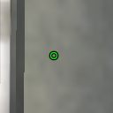
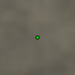

# UT99-UltiCross

UT99 Enhanced Crosshairs.

This project leverages the IG+ Crosshair Factory, and thus only works on
servers with IG+.


## Usage

Download the `UltiCross.utx` texture package from the releases page and install
to your UT99 `Textures` folder.

Add the desired crosshair configuration to your `InstaGibPlus.ini` file.


### Circle 4px Radius 1px Thickness with Outline



```ini
CrosshairLayers[0]=(Texture="UltiCross.CircleD7T4Modulate",OffsetX=0,OffsetY=0,ScaleX=1.000000,ScaleY=1.000000,Color=(R=255,G=255,B=255,A=255),Style=4,bSmooth=False,bUse=True)
CrosshairLayers[1]=(Texture="UltiCross.CircleD7T1",OffsetX=0,OffsetY=0,ScaleX=1.000000,ScaleY=1.000000,Color=(R=0,G=255,B=0,A=255),Style=3,bSmooth=False,bUse=True)
```

### Dot 4px Diameter with Outline



```ini
CrosshairLayers[0]=(Texture="UltiCross.DotD7Modulate",OffsetX=0,OffsetY=0,ScaleX=1.000000,ScaleY=1.000000,Color=(R=255,G=255,B=255,A=255),Style=4,bSmooth=False,bUse=True)
CrosshairLayers[1]=(Texture="UltiCross.DotD4",OffsetX=0,OffsetY=0,ScaleX=1.000000,ScaleY=1.000000,Color=(R=0,G=255,B=0,A=255),Style=3,bSmooth=False,bUse=True)
```
